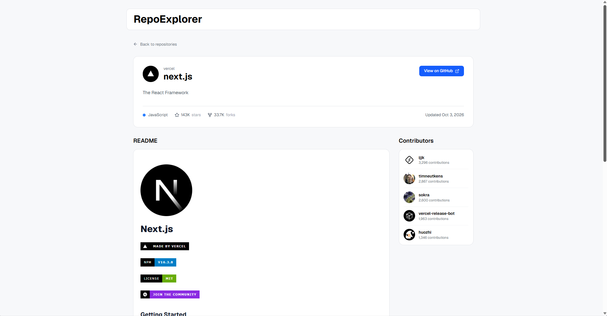

# GitHub Repository Explorer

A simple web app for exploring GitHub repositories.

You can search for repositories, browse paginated results, open a repository to see more details, read its README, and view its top contributors.

## Live Demo

[View the project here](https://repo-exlorer.vercel.app/)

## Features

- Search GitHub repositories
- Paginated search results
- Dynamic repository detail pages
- Repository information such as stars, forks, language, and last update
- README rendering
- Top contributors
- Loading states
- Error and 404 handling
- Dynamic page metadata

## Built With

- Next.js
- React
- TypeScript
- Tailwind CSS
- GitHub REST API
- Lucide React

## Screenshot

## Purpose

I built this project to practice working with real API data, server-side fetching, dynamic routes, pagination, loading states, and error handling with Next.js.